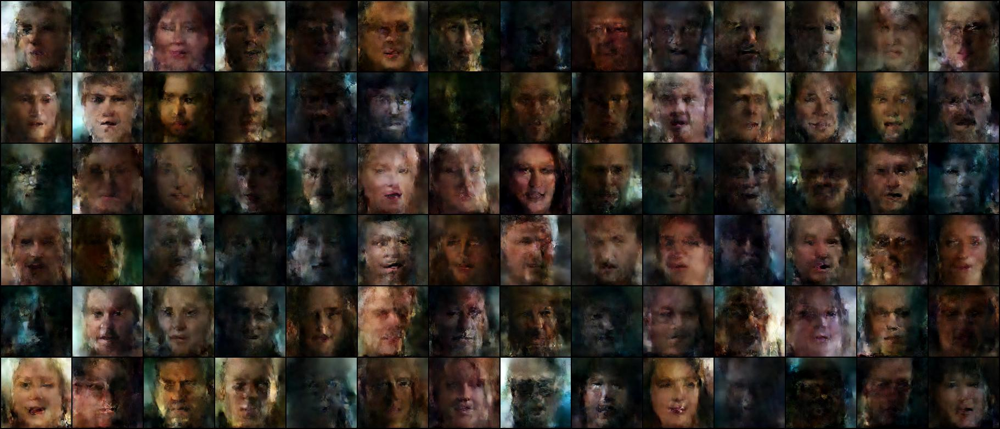
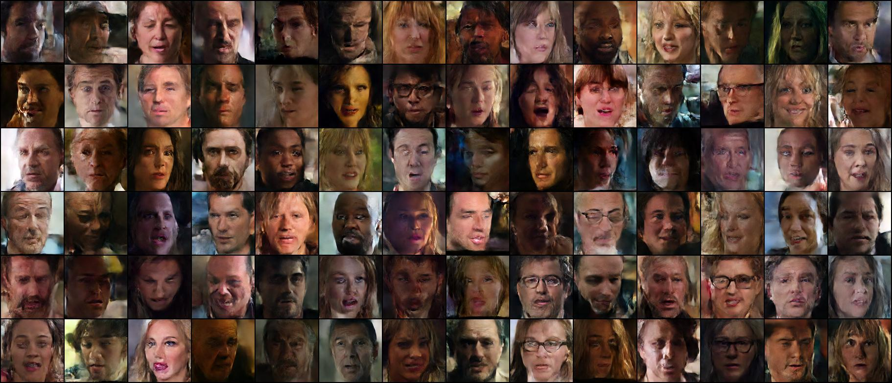
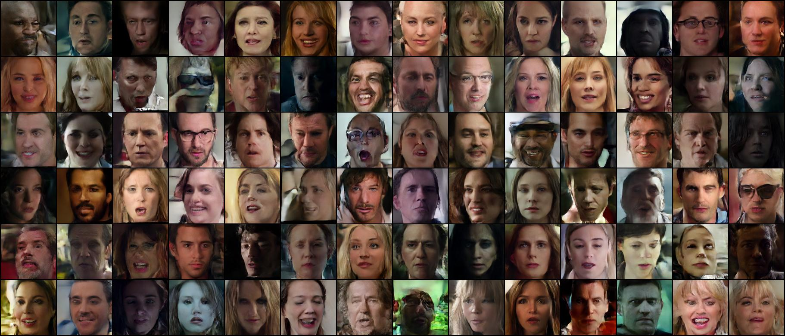

# taesd3-latent-diffusion

## sample output

**sample at 4k iterations**  

**sample at 16k iterations**  

**sample at 42k iterations**  

---

## references

- [TAESD3: Tiny Autoencoder for Efficient Stable Diffusion](https://github.com/madebyollin/taesd)  
- [Denoising Diffusion Probabilistic Model](https://keras.io/examples/generative/ddpm/)
